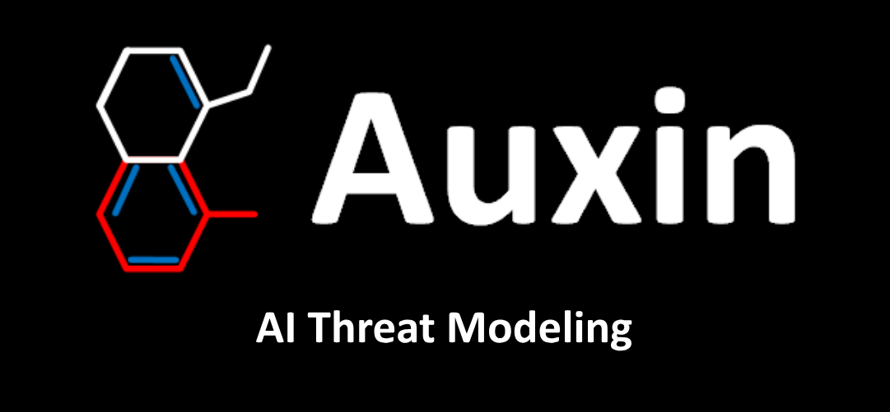

STRIDE GPT is an AI-powered threat modelling tool that leverages Large Language Models (LLMs) to generate threat models and attack trees for a given application based on the STRIDE methodology. Users provide application details, such as the application type, authentication methods, and whether the application is internet-facing or processes sensitive data. The model then generates its output based on the provided information.

---

## Demo Architectures

STRIDE GPT can analyze various application architectures. Below are two sample architecture patterns:

### AWS 3-Tier Architecture


This architecture shows a typical AWS deployment with:
- Frontend tier (handling user interactions)
- Backend tier (application logic)
- Database tier (data storage)
- Components like CloudFront, EC2, and RDS

### Web Application Architecture


This diagram illustrates a more detailed web application with:
- Load balanced web services
- Application servers
- Data warehouse and analytics components
- CDN and cloud storage

---

## Installation & Usage

### Option 1: Cloning the Repository

1. Clone this repository:

    ```bash
    git clone https://github.com/Auxin-io/Auxin-AI-Apps-Threat-Modeler
    ```

2. Change to the cloned repository directory:

    ```bash
    cd Auxin-AI-Apps-Threat-Modeler
    ```

3. Install the required Python packages:

    ```bash
    pip install -r requirements.txt
    ```

4. Set up environment variables:
   
   a. Copy the `.env.example` file to a new file named `.env`:
   ```
   cp .env.example .env
   ```
   
   b. Edit the `.env` file to add your API keys and/or endpoint URLs:
   ```
   GITHUB_API_KEY=your_actual_github_api_key
   OPENAI_API_KEY=your_actual_openai_api_key
   ANTHROPIC_API_KEY=your_actual_anthropic_api_key
   AZURE_API_KEY=your_actual_azure_api_key
   AZURE_API_ENDPOINT=your_actual_azure_endpoint
   AZURE_DEPLOYMENT_NAME=your_actual_azure_deployment_name
   GOOGLE_API_KEY=your_actual_google_api_key
   MISTRAL_API_KEY=your_actual_mistral_api_key
   OLLAMA_ENDPOINT=http://localhost:11434
   LM_STUDIO_ENDPOINT=http://localhost:1234
   ```

5. Run the Streamlit app:

    ```bash
    streamlit run main.py
    ```

6. Open the app in your web browser using the provided URL.

7. Follow the steps in the Streamlit interface to use STRIDE GPT.

### Option 2: Using Docker Container

1. Build the Docker image:

    ```bash
    docker build -t threatmodeling .
    ```

2. Run the docker container:

    ```bash
    docker run -d -p 8501:8501 --env-file .env stridegpt
    ```

3. Open a web browser and navigate to `http://localhost:8501` to access the app running inside the container.

4. Follow the steps in the Streamlit interface to use STRIDE GPT.

Note: When you run the application (either locally or via Docker), it will automatically load the environment variables you've set in the `.env` file. This will pre-fill the API keys in the application interface.
